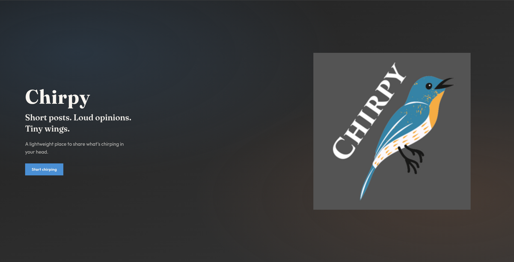

## Index

1. [Chirpy](#chirpy)

## Chirpy

Chirpy is a social network similar to Twitter.

A "chirp" is just a short message that a user can post to the API, like a "tweet".

## Migrations

Migrations are being handled by goose, and sqlc. See:

- [../docs/goose.md](../docs/goose.md)
- [../docs/sqlc.md](../docs/sqlc.md)

